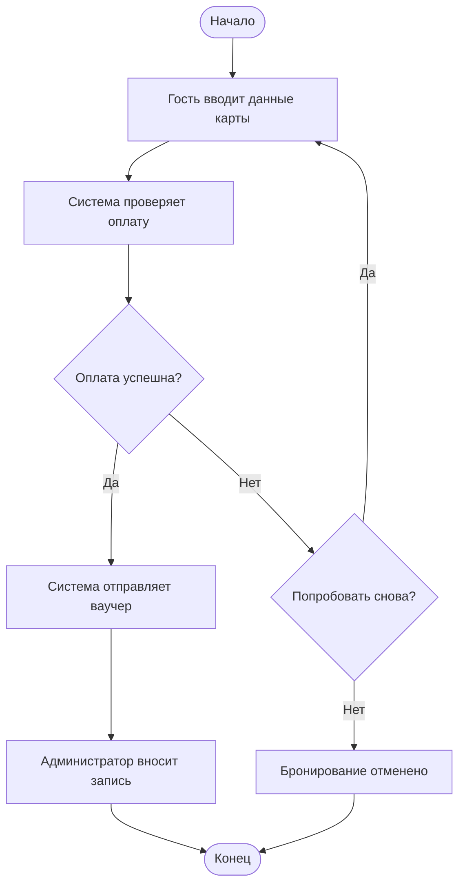

# Flowchart — Алгоритм оплаты бронирования

```mermaid
flowchart TD
    A([Начало]) --> B[Гость вводит данные карты]
    B --> C[Система проверяет оплату]
    C --> D{Оплата успешна?}
    D -- Да --> E[Система отправляет ваучер]
    E --> F[Администратор вносит запись]
    F --> G([Конец])
    D -- Нет --> H{Попробовать снова?}
    H -- Да --> B
    H -- Нет --> I[Бронирование отменено]
    I --> G
```
