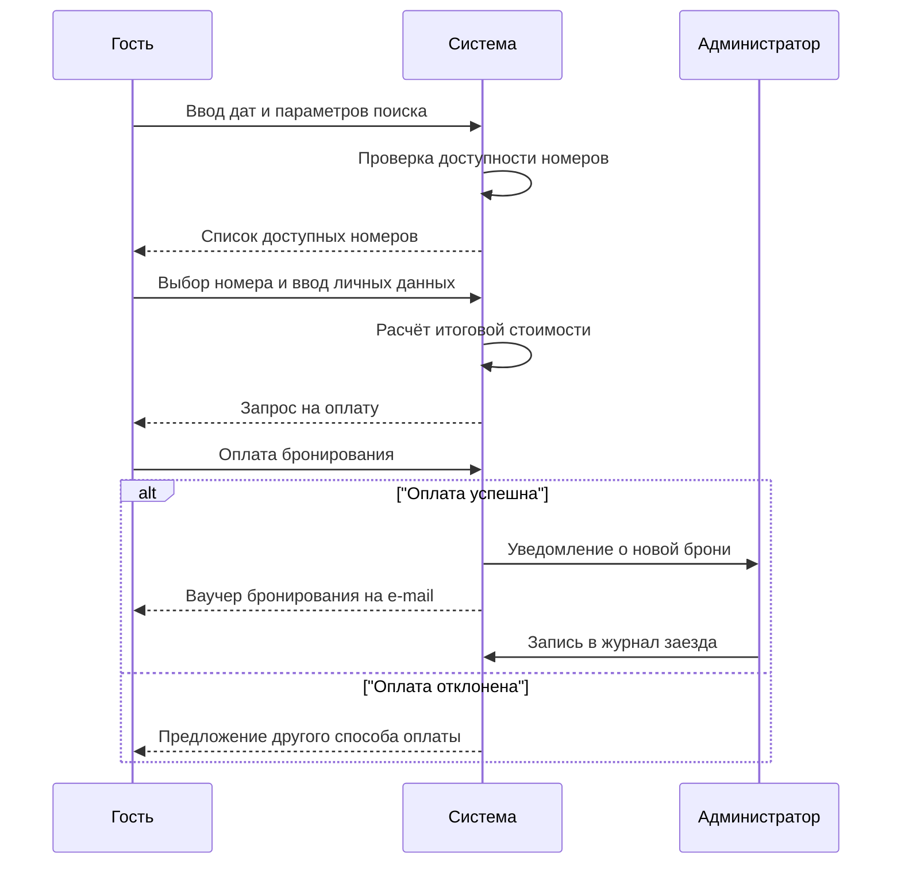

# Бронирование номера в отеле

```mermaid
sequenceDiagram
    participant Гость
    participant Система
    participant Администратор

    Гость->>Система: Ввод дат и параметров поиска
    Система->>Система: Проверка доступности номеров
    Система-->>Гость: Список доступных номеров
    Гость->>Система: Выбор номера и ввод личных данных
    Система->>Система: Расчёт итоговой стоимости
    Система-->>Гость: Запрос на оплату
    Гость->>Система: Оплата бронирования

    alt "Оплата успешна"
        Система->>Администратор: Уведомление о новой брони
        Система-->>Гость: Ваучер бронирования на e-mail
        Администратор->>Система: Запись в журнал заезда
    else "Оплата отклонена"
        Система-->>Гость: Предложение другого способа оплаты
    end

```

