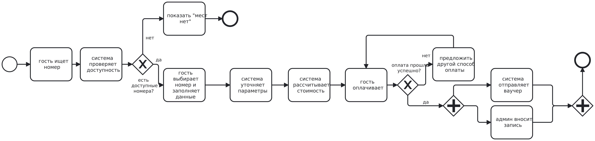
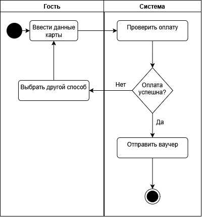
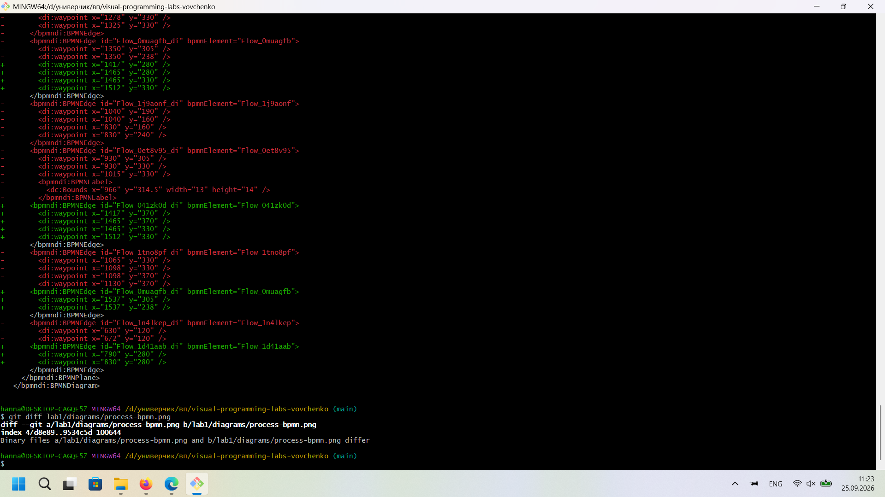

# Отчёт по лабораторной работе №1

## Описание процесса

**Тема:** Бронирование номера в отеле через онлайн-систему.

**Участники:** Гость, Система онлайн-бронирования, Администратор отеля.

Процесс начинается с того, что гость заходит на сайт отеля, указывает даты проживания и количество гостей. Система проверяет базу данных и формирует список доступных номеров. Гость выбирает подходящий номер, заполняет личные данные, после чего система рассчитывает итоговую стоимость и предлагает оплатить бронирование. Если оплата проходит успешно, система фиксирует номер за клиентом: параллельно отправляется ваучер на e-mail гостя и уведомляется администратор, который вносит запись в журнал заезда. Если оплата отклонена — гость может повторить попытку или выбрать другой способ оплаты. Предусмотрена также возможность отмены брони: при отмене более чем за 24 часа до заезда деньги возвращаются полностью, позже — удерживается штраф в размере стоимости первой ночи.

## Диаграммы

### BPMN-диаграмма

### UML Activity Diagram

### Sequence Diagram (Mermaid)

См. файл [docs/sequence.md](docs/sequence.md).

### Flowchart (Mermaid)

См. файл [docs/flowchart.md](docs/flowchart.md).

## Выводы

В процессе выпоолнения лабораторной научилась настраивать Git-репозиторий через командную строку, построила BPMN, UML Activity, Sequence и Flowchart, увидела разницу между текстовыми и бинарными форматами при версионировании.

