# Отчет по лабораторной работе №2
**Тема:** Node-RED  
**Студент:** Вовченко Анна

---

## 1. Способ установки и версии
* **Способ установки:** Docker Desktop с пробросом папки данных (`volume`) на хост-машину и портом `1880`
* **Версия Node-RED:** v5.0.7
* **Версия Node.js:** v24.20.0
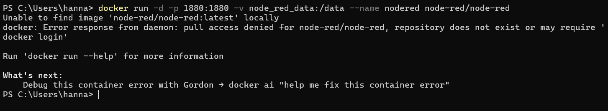
---

## 2. Краткое описание выполненной работы
В ходе лабораторной была освоена работа в Node-RED:
1. **Базовые потоки:** Настроены цепочки обработки данных с использованием нод `inject`, `debug`, `function`, `switch`, `change` и `template`.
2. **Внешние интеграции:** 
   * Выполнен HTTP-запрос к стороннему REST API (Chuck Norris Jokes) с парсингом JSON.
   * Настроена отправка и получение сообщений через MQTT-брокер (`broker.hivemq.com:1883`).
3. **Создание собственного REST API:** Создано 3 GET-эндпоинта (`/api/text`, `/api/info`, `/api/items`) с поддержкой параметров запроса и обработкой ошибок 400/404. Полная документация оформлена в `lab2/docs/api.md`.
4. **Dashboard:** Собран пользовательский интерфейс с индикатором (`gauge`) и графиком (`chart`).
5. **Telegram-бот:** Создан бот в Telegram, реагирующий на команду `/start` и отправляющий эхо-ответы.
6. **Файловая система и Контекст:** Реализовано сохранение логов в файл (`/data/log.txt`) и чтение из него, а также созданы счетчики и переменные на базе `flow context`.
7. **Ачивка №6 (Dashboard forms):** Интегрирована форма `ui_form` в дашборд для динамического изменения порога срабатывания датчика температуры без проведения редеплоя потока.

---

## 3. Примеры использованных AI-промптов
При выполнении работы использовались следующие ключевые промпты для генерации кода и отладки:
* *"Напиши JS-код для Function node в Node-RED, который использует let/const, условия if/else, цикл for, массив и объект. В конце функция должна возвращать объект с полем payload."*.
```javascript
// Массив цен товаров
const prices = [100, 250, 400, 150];
let totalSum = 0;
// Цикл for для подсчета суммы
for (let i = 0; i < prices.length; i++) {
    totalSum += prices[i];
}
// Проверка условия через if/else
let discount = 0;
if (totalSum > 500) {
    discount = 0.15; // 15% скидка
} else {
    discount = 0.05; // 5% скидка
}
const finalPrice = totalSum * (1 - discount);

// Возвращаем объект с результатом
msg.payload = {
    student: "Hanna", // Твоё имя/фамилия
    totalSum: totalSum,
    discountPercent: discount * 100,
    finalPrice: finalPrice,
    status: finalPrice > 500 ? "HIGH" : "LOW"
};
return msg;
```

* *"Напиши код функции для Telegram-бота в Node-RED, который при команде /start отправляет приветствие, а на остальные сообщения отвечают в формате эхо"*.
const text = msg.payload.content;
const chatId = msg.payload.chatId;
```javascript
if (text === "/start") {
    msg.payload.content = "Привет! Я бот Ханны Вовченко. Напиши мне что-нибудь!";
} else {
    msg.payload.content = "Эхо: " + text;
}

msg.payload.chatId = chatId;
msg.payload.type = "message";

return msg;
```

* *"Напиши код для Function node в Node-RED, который реализует счётчик нажатий, сохраняющий своё состояние в flow context при каждом вызове"*.
```javascript
// Достаем из context счетчик, если его нет — ставим 0
let count = flow.get("counter") || 0;

// Увеличиваем на 1 при каждом клике
count++;

// Сохраняем обновленное значение обратно в flow context
flow.set("counter", count);

// Формируем выводимый payload
msg.payload = {
    student: "Hanna Vovchenko",
    click_count: count,
    message: "Кнопка была нажата раз: " + count
};

return msg;
```
---

## 4. Освоенные ноды
* **Базовые:** `inject`, `debug`, `function`, `switch`, `change`, `template`[cite: 7].
* **Сетевые / Интеграции:** `http request`, `mqtt in`, `mqtt out`, `http in`, `http response`.
* **Интерфейс (Dashboard):** `ui_gauge`, `ui_chart`, `ui_form`.
* **Telegram:** `telegram receiver`, `telegram sender`.
* **Хранение данных:** `file`, `file in`, `flow context` (`flow.get` / `flow.set`).

---

## 5. Скриншоты разработанных потоков

### 2.1. Inject → Debug
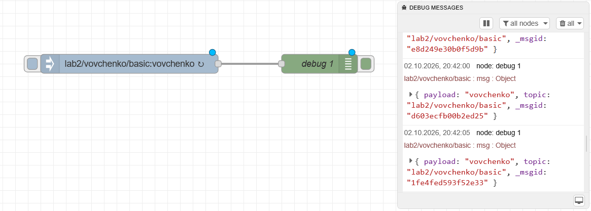

### 2.2. Function Node
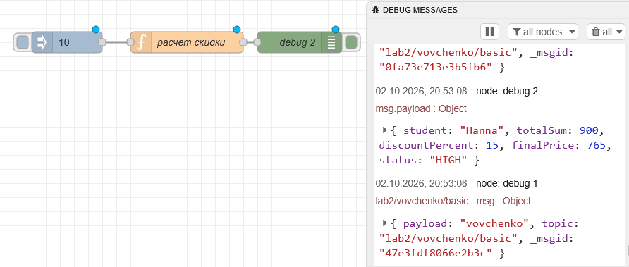

### 2.3. Switch Node
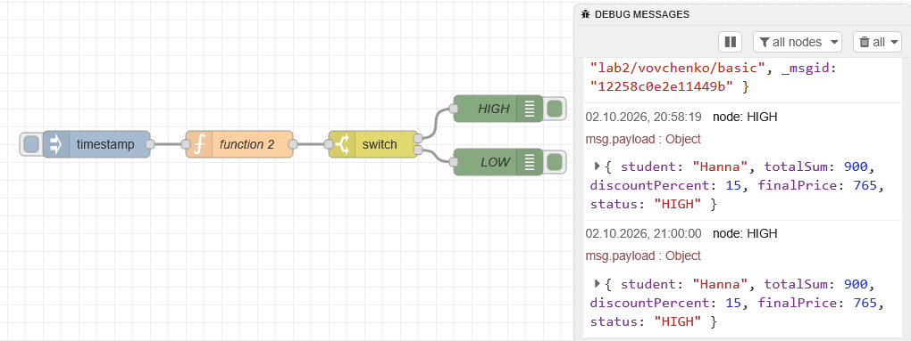

### 2.4. Change Node
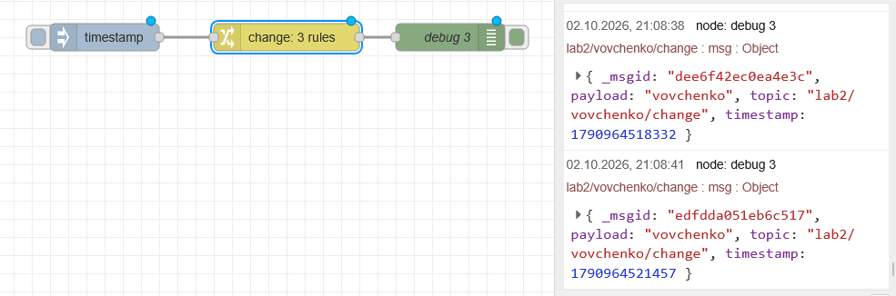

### 2.5. Template Node
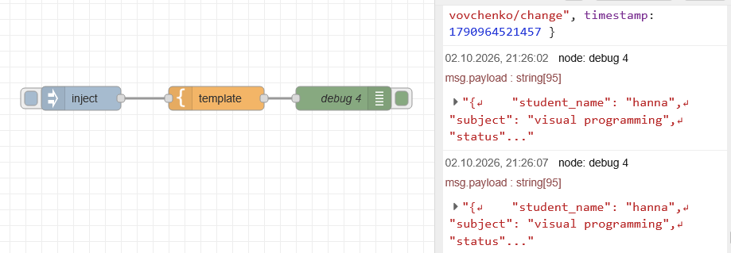

### 2.6. HTTP Request Node
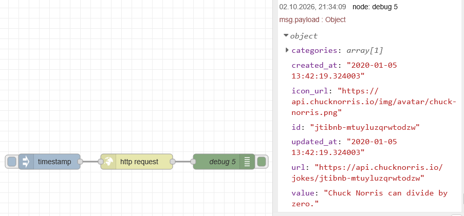

### 2.7. MQTT
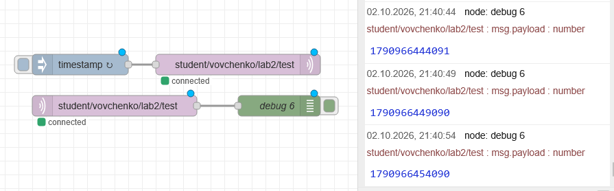
### 2.8. GET-эндпоинты (REST API)
* **Эндпоинт /api/text:**  
  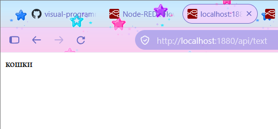
* **Эндпоинт /api/info:**  
  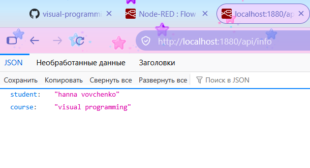
* **Эндпоинт /api/items (успешный запрос 200 OK):**  
  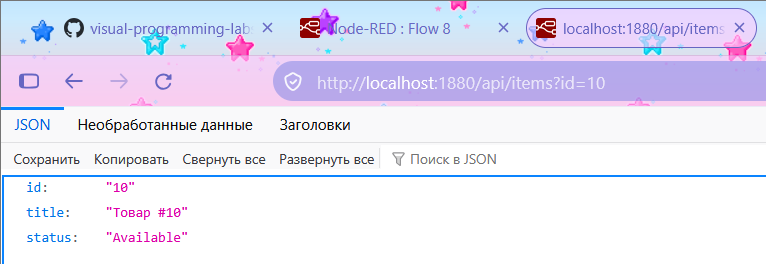
  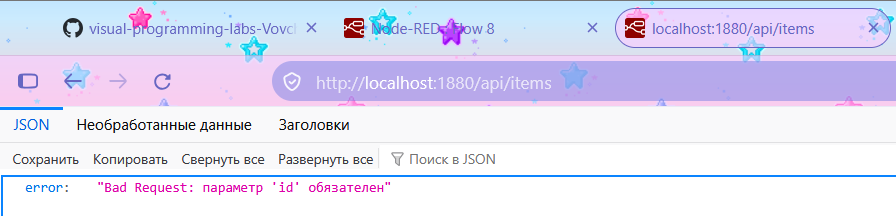

### 2.9. Dashboard + Ачивка №6 (Forms)
* **Схема потока:**  
  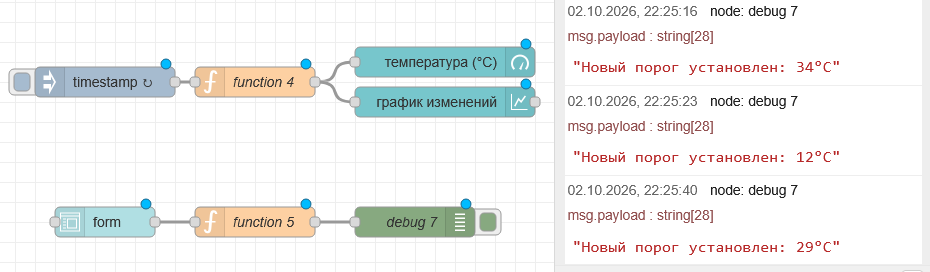
* **Интерфейс Dashboard (UI):**  
  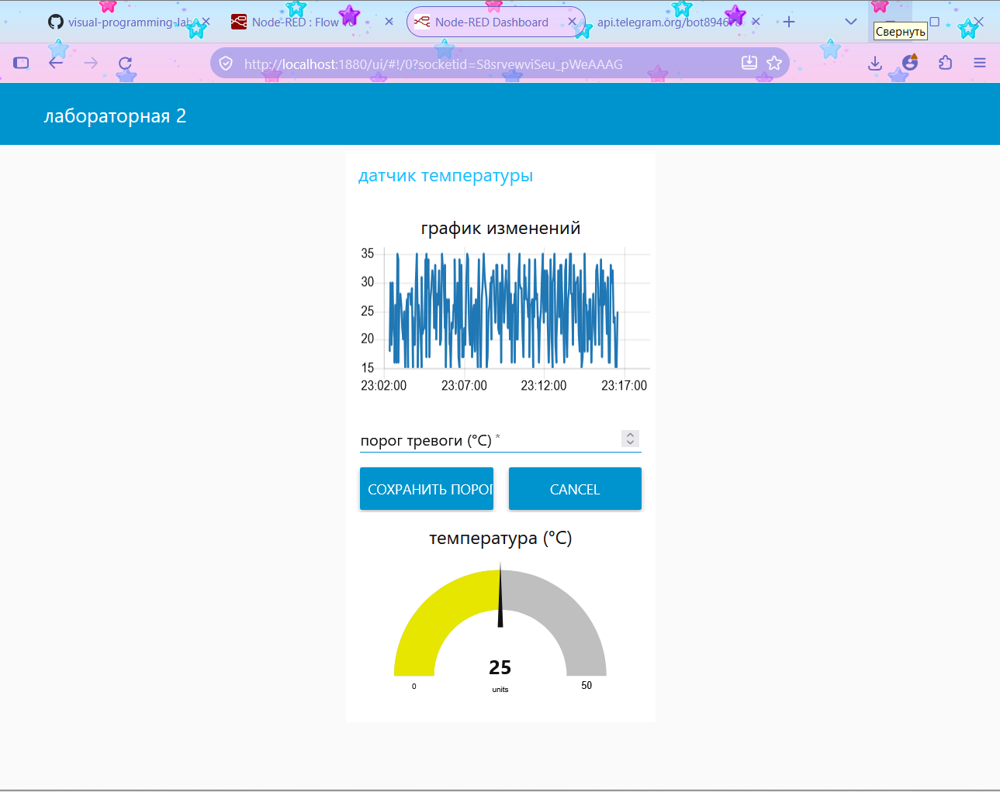

### 2.10. Telegram-бот
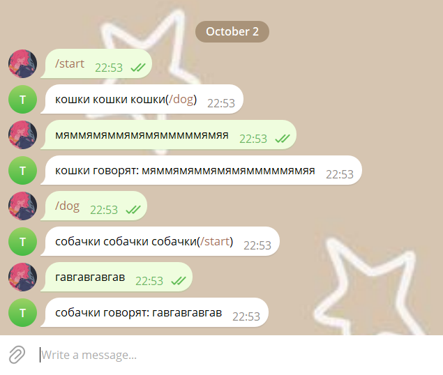

### 2.11. Чтение и запись файла
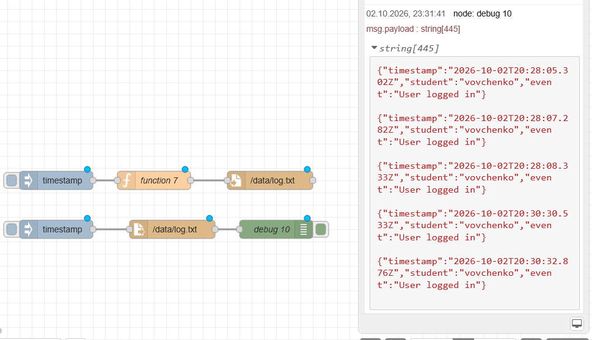

### 2.12. Работа с контекстом (flow context)
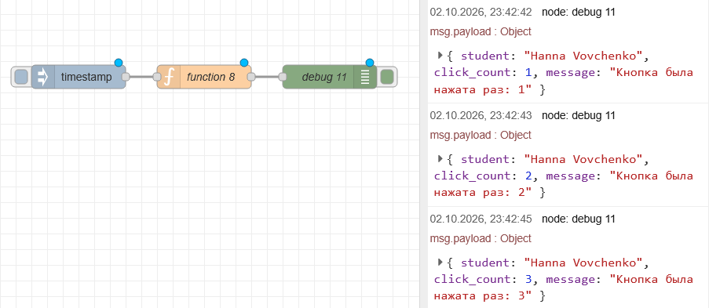
---

## 6. Выводы
